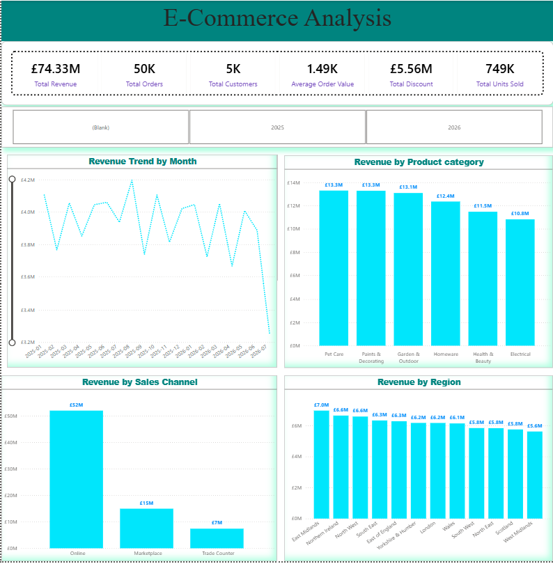
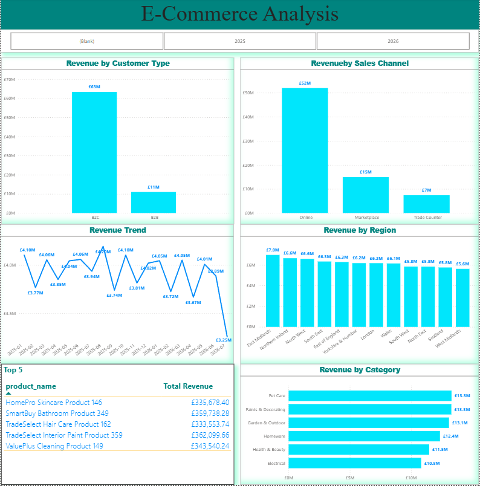
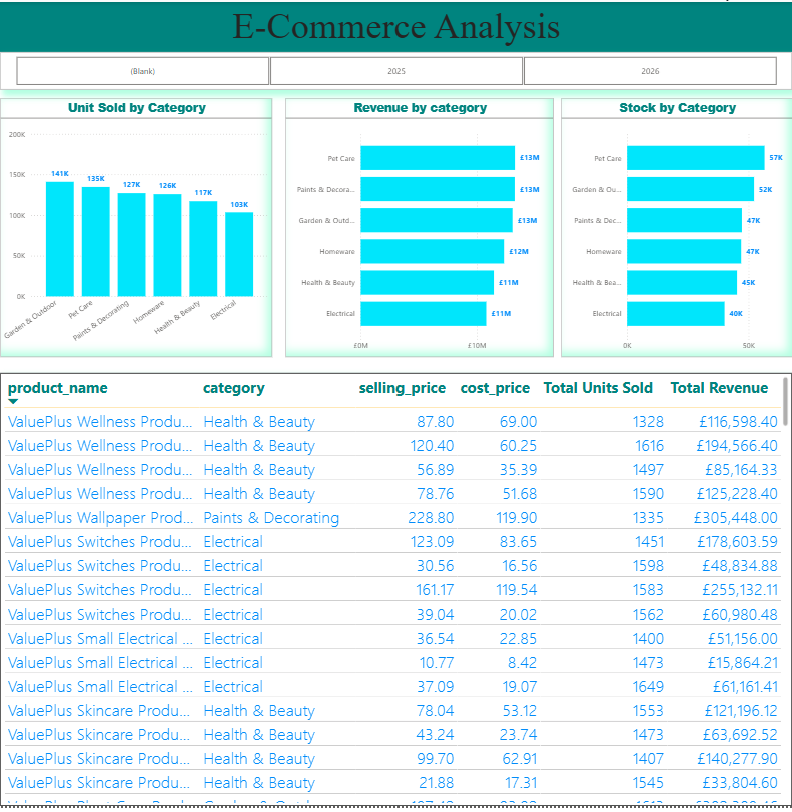
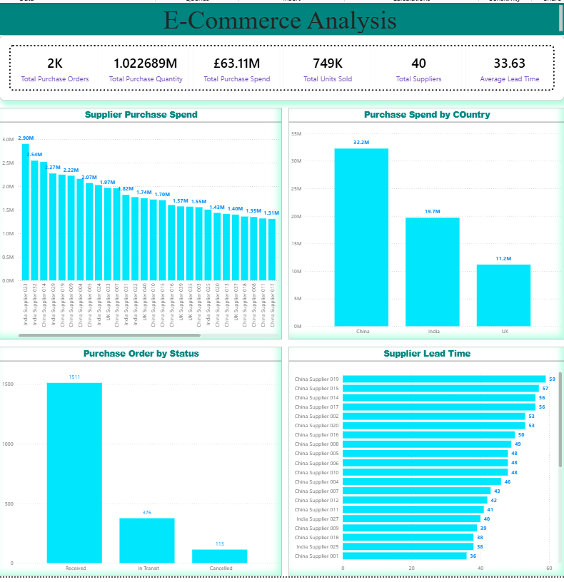
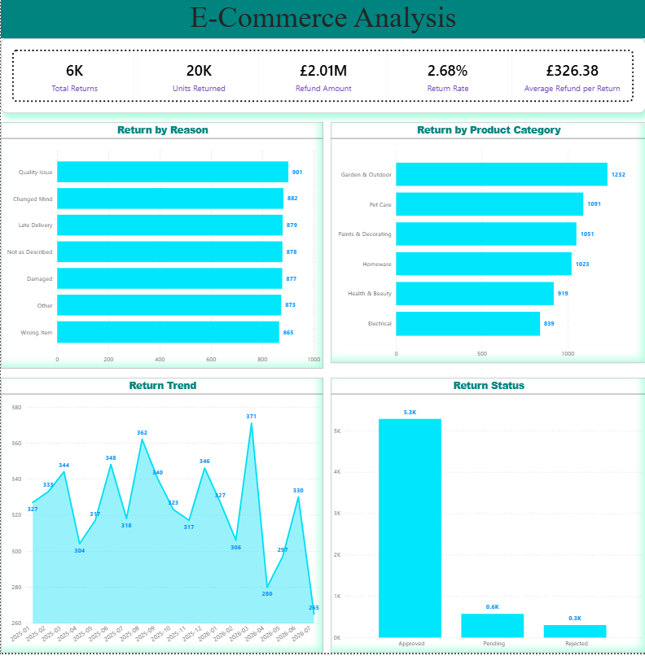

# Perfect2Trade E-Commerce Data Analytics

## Project Overview

Perfect2Trade is an independent retail and e-commerce analytics case study created for portfolio purposes.

The project simulates a UK retail business operating across multiple product categories and serving both B2C and B2B customers. The objective was to transform raw operational data into a structured analytical model and develop a Power BI dashboard that supports business performance analysis and decision-making.

The dataset is independently generated for portfolio purposes and does not represent actual Perfect2Trade customer, sales, inventory or financial data.

The project focuses on practical Data Analyst skills including data preparation, data modelling, DAX, business intelligence reporting, data visualisation and business insight generation.

---

## Business Problem

Management needs a clear view of commercial performance and operational risks across the business.

The analysis focuses on:

- Revenue and sales performance over time
- Product and category profitability
- Customer purchasing behaviour
- Inventory availability and reorder risks
- Supplier purchasing and delivery performance
- Product returns and refund exposure
- Identifying areas where management action could improve performance

---

## Project Objectives

The project was designed to:

1. Prepare and validate raw retail datasets for analysis.
2. Transform and structure the data using Power Query.
3. Build a relational analytical data model in Power BI.
4. Develop DAX measures for commercial and operational KPIs.
5. Create an interactive five-page Power BI dashboard.
6. Identify meaningful business trends and performance issues.
7. Translate analytical findings into practical recommendations.

---

## Key Results

| KPI | Result |
|---|---:|
| Revenue | **£74.33M** |
| Gross Profit | **£28.31M** |
| Gross Margin | **38.1%** |
| Orders | **50K** |
| Customers | **5K** |
| Units Sold | **749K** |
| Discount | **£5.56M** |
| Products Below Reorder Level | **223** |
| Late Shipments | **664** |
| Average Delivery Delay | **1.50 days** |
| Refund Amount | **£2.01M** |
| Return Rate | **2.68%** |

---

## Power BI Dashboard

The final Power BI report contains five analytical pages:

### 1. Executive / E-Commerce Overview

Provides a high-level view of revenue, orders, customers, units sold, gross profit, gross margin and revenue trends.

### 2. Sales / Customer Analysis

Analyses customer purchasing behaviour, sales performance, product revenue and customer-related trends.

### 3. Product & Inventory

Examines product performance, category profitability, stock levels and products below their reorder levels.

### 4. Procurement & Supplier Analysis

Analyses purchase orders, purchasing spend, supplier performance, lead times and shipment delays.

### 5. Returns & Operations

Analyses returns, refund values, return reasons and category-level return performance.

---
## Dashboard Preview

### Executive / E-Commerce Overview



### Sales / Customer Analysis



### Product & Inventory Analysis



### Procurement & Supplier Analysis



### Returns & Operations Analysis



## Key Business Insights

### 1. Revenue performance weakened in 2026

Revenue performance was broadly stable during the first half of 2026 but weakened significantly in July.

July 2026 revenue was approximately **17% lower than July 2025**.

**Recommendation:** Investigate the drivers of the July decline, including product demand, customer activity and sales mix, before considering targeted commercial actions.

### 2. Pet Care generates high revenue but has the weakest margin

Pet Care generated approximately **£13.30M in revenue**, the highest of the analysed categories, but recorded the lowest gross margin at **34.8%**.

**Recommendation:** Review pricing, discounting and product-level costs within Pet Care to identify opportunities to improve profitability without unnecessarily reducing sales volume.

### 3. Electrical has the strongest gross margin

Electrical generated approximately **£10.82M in revenue** with a gross margin of **40.5%**, the highest among the categories analysed.

**Recommendation:** Evaluate whether selected Electrical products could support profitable growth through increased visibility, cross-selling or targeted promotion.

### 4. Overall profitability remains healthy

The business generated approximately **£28.31M in gross profit** from **£74.33M in revenue**, producing a **38.1% gross margin**.

**Recommendation:** Maintain overall margin discipline while focusing improvement efforts on categories and products with weaker profitability.

### 5. Inventory availability presents a potential risk

**223 products** were identified as being below their defined reorder level.

**Recommendation:** Prioritise these products based on sales velocity and commercial importance to reduce the risk of stock-outs while avoiding unnecessary inventory accumulation.

### 6. Supplier delivery performance requires attention

The analysis identified **664 late shipments**, with an average delivery delay of approximately **1.50 days**.

**Recommendation:** Monitor supplier delivery performance and investigate recurring delays that could affect inventory availability and operational reliability.

### 7. Returns create a measurable financial impact

The business recorded approximately **6K returns**, representing around **20K returned units** and **£2.01M in refunds**. The overall return rate was **2.68%**, with Quality Issue identified as the leading return reason.

Garden & Outdoor recorded the highest number of returns by category.

**Recommendation:** Investigate the main quality-related return patterns and prioritise high-return categories and products for further review.

---

## Project Workflow

```text
Raw Data
   ↓
Data Validation & Profiling
   ↓
Power Query ETL
   ↓
Power BI Data Model
   ↓
DAX Measures
   ↓
Interactive Dashboard
   ↓
Business Insights
   ↓
Recommendations
# Data Model

The Power BI model uses a relational structure consisting of dimension and fact tables.

## Dimension Tables

- Customers
- Products
- Suppliers
- DimDate

## Fact Tables

- Orders
- Order_items
- Payments
- Inventory
- Purchase_Orders
- Shipments
- Returns

A dedicated Measures table is also used to organise analytical measures.

The model uses relationships between transactional fact tables and relevant dimensions to support consistent reporting and analysis.

---

## DAX & Analytical Measures

DAX was used to create business-focused measures including:

- Total Revenue
- Total Orders
- Total Customers
- Units Sold
- Total COGS
- Gross Profit
- Gross Margin %
- Revenue Previous Year
- Revenue YoY %
- Products Below Reorder Level
- Average Delivery Delay
- Late Shipments
- Late Shipment %
- Return Rate
- Refund Amount

Example gross profit calculation:

```dax
Gross Profit =
[Total Revenue] - [Total COGS]
```

Gross margin:

```dax
Gross Margin % =
DIVIDE(
    [Gross Profit],
    [Total Revenue]
)
```

---

## Tools & Technologies

- Python
- Pandas
- Power Query
- Power BI
- DAX
- Git
- GitHub
- Visual Studio Code

---

## Repository Structure

```
ecommerce-data-analytics/
│
├── data/
│   ├── profiling/
│   └── raw/
│
├── documentation/
│   ├── business_insights.md
│   └── project_documentation.md
│
├── powerbi/
│
├── python/
│
├── screenshots/
│
├── sql/
│
├── .gitignore
└── README.md
```

---

## Documentation

Detailed project documentation is available in:

- `documentation/project_documentation.md` — complete project methodology and technical documentation
- `documentation/business_insights.md` — detailed findings, business implications and recommendations

---

## Skills Demonstrated

### Data Preparation

- Data profiling
- Data validation
- Data cleaning
- Power Query transformations
- Handling relationships between datasets

### Data Modelling

- Fact and dimension modelling
- Relationship design
- Date table implementation
- Analytical model development

### Business Intelligence

- Power BI dashboard development
- KPI design
- Interactive filtering
- Trend analysis
- Category and product analysis
- Operational performance analysis

### DAX

- Aggregations
- Calculated measures
- Time-intelligence analysis
- Year-over-year analysis
- Profitability calculations
- Inventory and operational KPIs

### Business Analysis

- Identifying performance trends
- Profitability analysis
- Inventory risk analysis
- Supplier performance analysis
- Returns analysis
- Translating data into business recommendations

### Version Control

- Git repository management
- Commits
- Branch management
- Remote repository management
- GitHub version control workflow

---

## Analytical Limitations

The dataset is synthetically generated for portfolio purposes. Therefore, the results should be interpreted as an analytical case study rather than real-world Perfect2Trade business performance.

The analysis identifies relationships and patterns in the available data but does not establish causation. Further investigation and additional business context would be required before implementing operational or commercial decisions.

---

## Project Outcome

The completed project demonstrates an end-to-end Data Analyst workflow:

**Business Problem → Data → ETL → Data Model → DAX → Dashboard → Insights → Recommendations**

The final solution provides management-oriented analysis across commercial performance, profitability, products, inventory, procurement, suppliers and returns.

---

## Conclusion

Perfect2Trade demonstrates how structured data analysis and Power BI can be used to turn operational retail data into actionable business intelligence.

The project combines technical data skills with business-focused analysis, with particular emphasis on producing insights that can support practical management decisions.